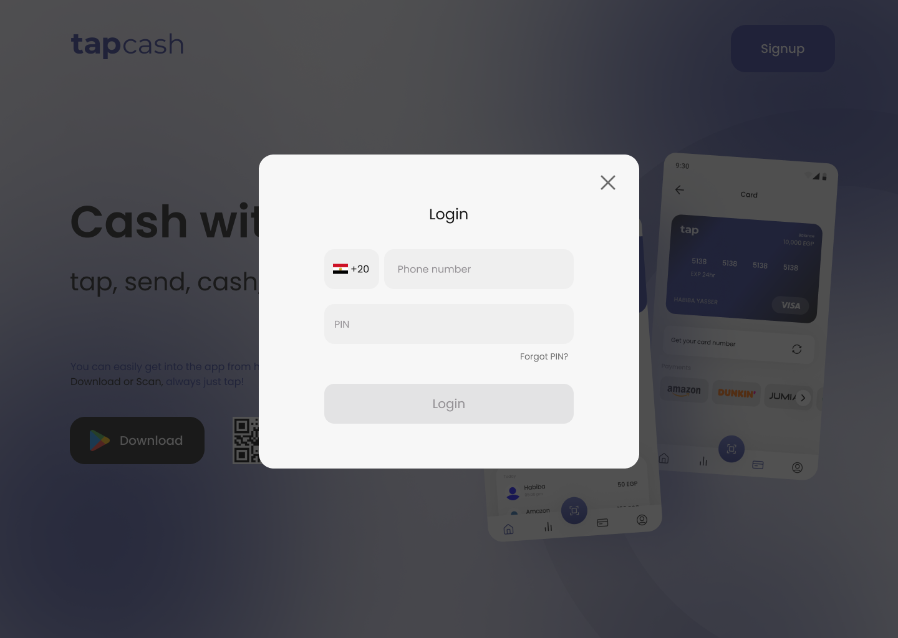
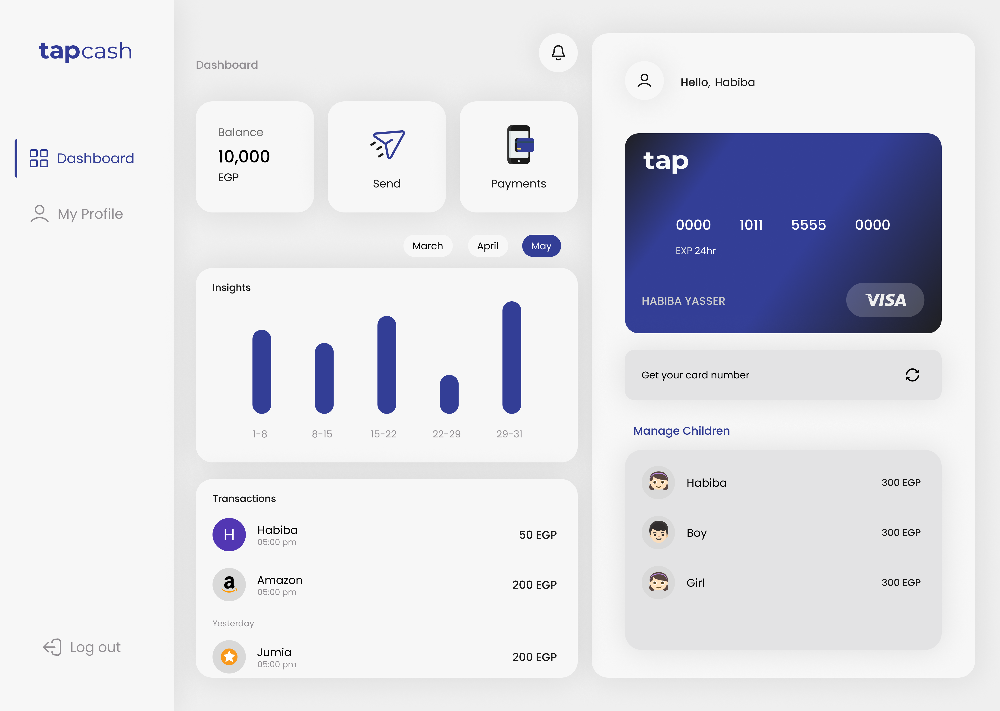

<div align="center">

<h1/>
</div>


<div align="center">

[](https://github.com/Orange-Hackathon/Front-End/contributors)
[](https://github.com/Orange-Hackathon/Front-End/issues)
[](https://github.com/Orange-Hackathon/Front-End/blob/master/LICENSE)
[](https://github.com/Orange-Hackathon/Front-End/network)
[](https://github.com/Orange-Hackathon/Front-End/stargazers)
[](https://img.shields.io/github/languages/count/Orange-Hackathon/Front-End)

</div>

<details open="open">
<summary>
<h2 style="display:inline">📝 Table of Contents</h2>
</summary>

- [📑 About](#about)
- [⛏️ Built With](#built-with)
- [📷 Features](#features)
- [🏁 Getting started](#getting-started)
- [✍️ Contributors](#contributors)
- [🔒 License](#license)

</details>

---

## 📑 About

- Tapcash is a smart wallet that allows parents to manage their children's money and teach them how to spend it wisely. It also allows children to learn how to spend their money wisely and to be responsible for their money.


## ⛏️ Built with

- [Reactjs](https://reactjs.org/)
- [Material UI](https://mui.com/)
- [React redux](https://react-redux.js.org/)
- [React router dom](https://reactrouter.com/en/main)
- [Axios](https://axios-http.com/docs/intro)

## 📷 Features


</details>

<details open="open">
<summary>
<h4 style="display:inline">
<strong><em> 🛬 Landing page</em></strong></h4>
</summary>


</details>

<details open="open">
<summary>
<h4 style="display:inline">


<strong><em>🔒 User Authentication</em></strong></h4>
</summary>

- Sign up
- Login in
- Forget Pin





</details open="open">

<details>
<summary>
<h4 style="display:inline">
<strong><em> 📊 Dashboard </em></strong></h4>
</summary>

- Your Balance
- Send money
- Payments
- Insights
- Transactions
- Manage children




</details>

<details open="open">
<summary>
<h4 style="display:inline">
<strong><em> 🙍‍♂️ Profile</em></strong></h4>
</summary>

- Your Information


</details>

<details open="open">
<summary>
<h4 style="display:inline">
<strong><em> 👶 Manage children</em></strong></h4>
</summary>

- Balance
- Limit
- Allowance
- Manage categories
- Recent transactions


</details>

<details open="open">
<summary>
<h4 style="display:inline">
<strong><em> 💵 Send money</em></strong></h4>
</summary>

- Balance
- Limit
- Allowance
- Manage categories
- Recent transactions


</details>


## 🏁 Getting started

1. **_Clone the repository_**

```sh
$ git clone https://github.com/Orange-Hackathon/Front-End.git
```

2. **_Navigate to repository directory_**

```sh
$ cd Front-End
```

3. **_Install dependencies_**

```sh
$ npm install
```

### Running

**_Running on development mode_**

```sh
$ npm start
```
## ✍️ Contributors

<table>
  <tr>

<td align="center">
<a href="https://github.com/Abd-ELrahmanHamza" target="_black">
<br /><sub><b>Abdelrahman Hamza</b></sub></a><br />
</td>
</tr>
</table>

## 🔒 License <a name = "license"></a>

> This software is licensed under MIT License, See [License](https://github.com/Orange-Hackathon/Front-End/blob/main/LICENSE) .
